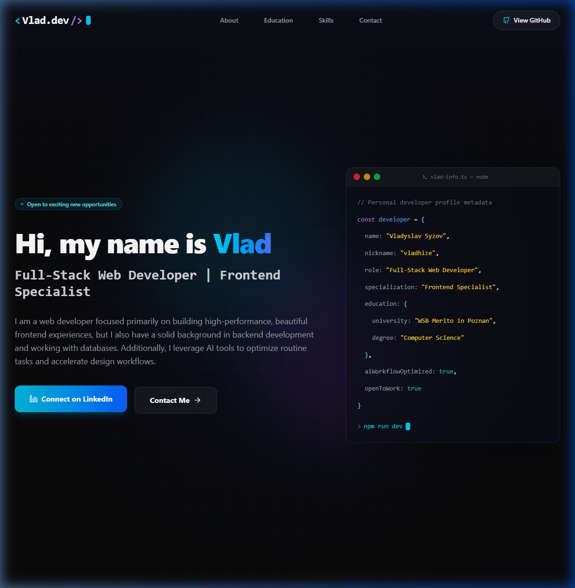
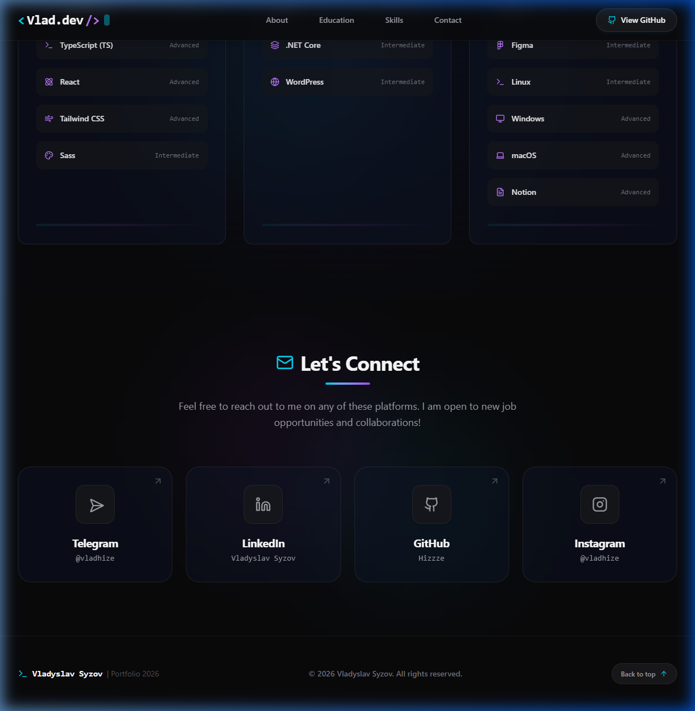

# Vladyslav Syzov — Web Developer Portfolio

A stunning, modern, and highly responsive single-page developer portfolio landing page built using **React**, **Vite**, **TypeScript**, and **Tailwind CSS (v4)**.

🌐 **Live URL:** [vladyslavportfolio.netlify.app](https://vladyslavportfolio.netlify.app/)

---

## 🎨 Design & Interactions

*   **Dark-Themed Aesthetics:** Built on a deep space (`zinc-950`) color palette with neon cyan and purple gradient accents.
*   **Glassmorphism:** Navigation bar and timeline cards utilize frosted backdrop blur panels.
*   **Spotlight Hover Effect:** Tech stack cards track mouse cursor coordinates dynamically to generate localized radial border highlights.
*   **Premium Animations:**
    *   Continuous waving hand emoji animation (`👋`) in the Hero section.
    *   Floating/bobbing effect on the main LinkedIn CTA to prompt interaction.
    *   Staggered entrance animations (`fadeInUp`) for page elements on load.
*   **Clean Portals:** Contact page redesigned into clean social media cards linking to Telegram, Instagram, GitHub, and LinkedIn (with no text input forms).

---

## 🛠️ Tech Stack & Ecosystem

*   **Core:** React 19, TypeScript, Vite 8
*   **Styling:** Tailwind CSS v4, CSS3 Variables, Keyframe Animations
*   **Icons:** Lucide React

---

## 📸 Screenshots

### Hero Section & Terminal Mockup


### Let's Connect Social Portals


---

## 🚀 Getting Started

### Prerequisites

*   Node.js (v18 or higher recommended)
*   npm

### Installation

1.  Clone the repository:
    ```bash
    git clone https://github.com/Hizzze/MyPortfolioWeb.git
    cd MyPortfolioWeb
    ```

2.  Install dependencies:
    ```bash
    npm install
    ```

3.  Run the local development server:
    ```bash
    npm run dev
    ```

4.  Build the production-ready static bundle:
    ```bash
    npm run build
    ```
    *(The output assets will be generated in the `dist/` directory)*
